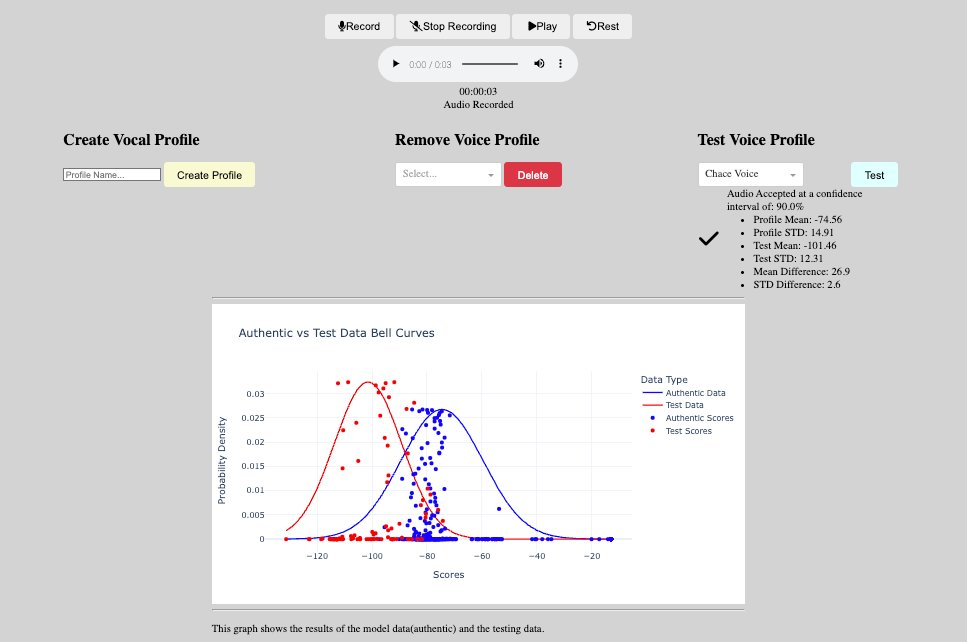
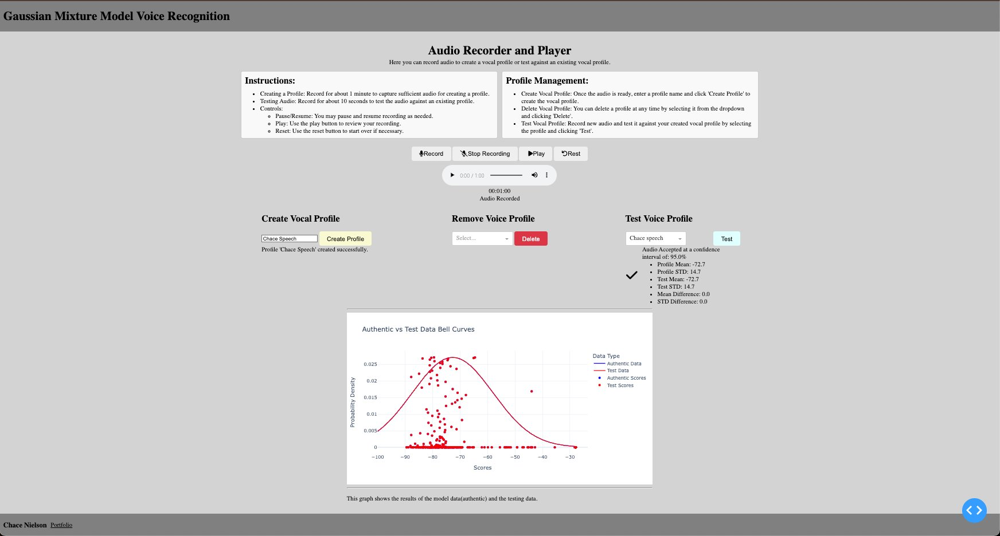
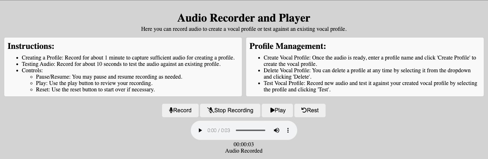

# Voice Recognition

A test Dash application to test voice recognition using machine learning and Gaussian Mixture Models (GMM). This application allows users to create vocal models and then test audio against these models.

## Table of Contents
- [Description](#description)
- [Features](#features)
- [Technologies Used](#technologies-used)
- [Installation](#installation)
- [Usage](#usage)
- [Deployment](#deployment)
- [Screenshots](#screenshots)
- [Contact](#contact)

## Description

The Voice Recognition application enables users to record vocal profiles that can be tested against test audio using a Gaussian Mixture Model. The project was initially developed as a Jupyter Notebook to demonstrate the results of various speech models against different test audio files. It was later adapted into a Dash application to provide a user-friendly interface.

## Features

- **Voice Recording:** Users can record vocal profiles.
- **Model Creation:** Create models using Gaussian Mixture Models (GMM).
- **Audio Testing:** Test recorded audio against the created models.
- **Interactive Interface:** User-friendly Dash application.

## Technologies Used

- **Dash:** Web application framework for Python.
- **Plotly:** Graphing library for creating interactive plots.
- **Python:** Programming language used for development.
- **CSS:** Styling for the web interface.
- **Machine Learning:** Gaussian Mixture Model for voice recognition.

## Installation

To run the project locally:

1. Clone the repository:
   ```sh
   git clone https://github.com/ChaceN89/voice-recognition.git
   ```
2. Navigate to the project directory:
   ```sh
   cd voice-recognition
   ```
3. Create and activate a virtual environment:
   ```sh
   python -m venv venv
   source venv/bin/activate # On Windows use `venv\Scripts\activate`
   ```
4. Install the required dependencies:
   ```sh
   pip install -r requirements.txt
   ```

## Usage

To run the application, execute the following command:

```sh
python main.py
```

The application will start and can be accessed via your web browser at `http://127.0.0.1:8050`.

### Instructions:
- **Creating a Profile:** Record for about 1 minute to capture sufficient audio for creating a profile.
- **Testing Audio:** Record for about 10 seconds to test the audio against an existing profile.
- **Controls:**
  - **Pause/Resume:** You may pause and resume recording as needed.
  - **Play:** Use the play button to review your recording.
  - **Reset:** Use the reset button to start over if necessary.

### Profile Management:
- **Create Vocal Profile:** Once the audio is ready, enter a profile name and click 'Create Profile' to create the vocal profile.
- **Delete Vocal Profile:** You can delete a profile at any time by selecting it from the dropdown and clicking 'Delete'.
- **Test Vocal Profile:** Record new audio and test it against your created vocal profile by selecting the profile and clicking 'Test'.

## Deployment

Currently, there are no deployment instructions for this project.

## Screenshots





## Contact

If you have any questions or feedback, please contact:

Project Link: [https://github.com/ChaceN89/voice-recognition](https://github.com/ChaceN89/voice-recognition)

My Portfolio: [https://chacenielson.com](https://chacenielson.com)
